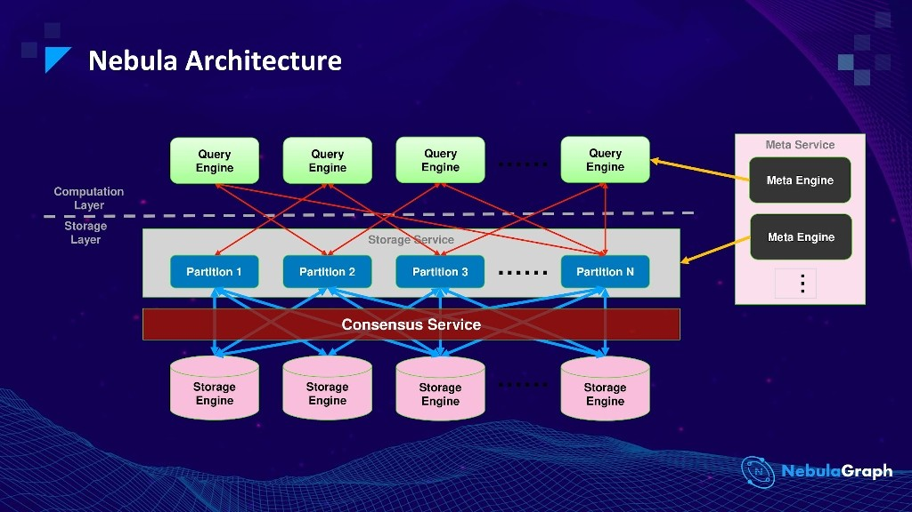

# Go feat. Nebula Graph

This project uses the Nebula Go driver to interface with Nebula Graph 1.0.
The client example is adjusted from [here](https://github.com/vesoft-inc/nebula-go/blob/master/example/graph_client_example.go).

👉 For an example of how to run Nebula Graph in Kubernetes, see [KUBERNETES.md](KUBERNETES.md).

## Reading Material

- [Nebula Graph v2.0.0 rc1 Release Note](https://discuss.nebula-graph.io/t/nebula-graph-v2-0-0-rc1-release-note/832) (January 6th, 2021)

## Local Setup

To start Nebula, run

```bash
docker-compose up
```

Note that this setup uses Docker network `172.29.0.0/16`.
If that doesn't fit, changes to [docker-compose.yml](docker-compose.yml) are required.

## Nebula Graph

The Nebula Graph database consists of four components:

- The Storage Service,
- the Metadata Service,
- the Query Engine Service and
- the Client.



The [docker-compose.yml](docker-compose.yml) setup is taken from
[here](https://github.com/vesoft-inc/nebula-docker-compose/tree/v1.0).
All three services described above are started with three replicas each,
however the image version was changed from `nightly` to a fixed tag.

### Graph Studio

After starting the services with Docker Compose or Kubernetes (see [KUBERNETES.md](KUBERNETES.md)), visit the following
address in your Browser:

- [http://localhost:7001/?lang=EN_US](http://localhost:7001/?lang=EN_US)

From there, connect to the running database using:

- Host: `<your IP>:3699`
- User: `user` (literally)
- Password: `password` (literally)

Note that you _must_ use the IP of your host machine. Using either
`localhost` or `127.0.0.1` will not work.

### Console

To open the console, run

```bash
docker run --rm -ti --network nebula-go_nebula-net vesoft/nebula-console:v2 -u user -p password --address=graphd1 --port=3699
```

### Example queries

This nGQL statement starts at _Bob_, walks all _like_ relations and returns the liked person,
as well as the degree of likeness:

```nGQL
GO 1 STEPS FROM "Bob" OVER like YIELD $^.person.name, $$.person.name, like.likeness;
```

The same query can be written in OpenCypher like this:

```cypher
MATCH (p:person) -[l:like]-> (p2:person) WHERE id(p) == "Bob" RETURN p.name, p2.name, l.likeness
```

## Quirks

In order to use OpenCypher's `MATCH` e.g. like so ...

```cypher
MATCH (p:person) -[:like]-> (p2:person) RETURN p, p2
```

... nothing is returned. This matches what is described in the [MATCH](https://docs.nebula-graph.io/2.0/3.ngql-guide/7.general-query-statements/2.match/)
documentation, namely

> The MATCH statement uses a **native index** to locate a source vertex.
> The vertex can be in any position in a pattern. In other words, in a valid `MATCH` statement, **there must be an indexed property or tag, or a specific VID.**

In addition, here's another nasty one:

> ### OpenCypher compatibility
>
> For now, nGQL DOES NOT support scanning all vertices and edges with `MATCH`.
> For example, `MATCH (v) RETURN v`.

However for our case, we're actually matching using the tag constraint `person`.

Just declaring a tag index like so does appears to create a job only:

```cypher
CREATE TAG INDEX person_index ON person()
```

returns

```text
+------------+
| New Job Id |
+------------+
| 11         |
+------------+
```

After that, the queries execute but to not return anything. Rebuilding the index using

```cypher
REBUILD TAG INDEX person_index
```

Just appears to initiate the command.

The job status can be shown using

```cypher
SHOW JOBS
```

This gives something like

```text
+--------+----------------------+------------+------------+------------+
| Job Id | Command              | Status     | Start Time | Stop Time  |
+--------+----------------------+------------+------------+------------+
| 12     | "REBUILD_EDGE_INDEX" | "QUEUE"    | 0          | 0          |
+--------+----------------------+------------+------------+------------+
| 11     | "REBUILD_TAG_INDEX"  | "RUNNING"  | 1611874688 | 0          |
+--------+----------------------+------------+------------+------------+
```

The reason appears to be what's buried in the [Job statements FAQ](https://docs.nebula-graph.io/2.0/3.ngql-guide/18.operation-and-maintenance-statements/4.job-statements/#how_to_troubleshoot_job_problems):

> The `SUBMIT JOB` operations use the HTTP port. Please check if the HTTP ports on the machines
> where the Storage Service is running are working well. You can use the following command to debug.
>
> ```bash
> curl "http://{storaged-ip}:12000/admin?space={test}&op=compact"
> ```

Now this is similar to what the health checks in the Docker Compose file are doing, however as of
now, all of them show `Up 4 minutes (unhealthy)`.

Exec'ing into e.g. the graphd0 container

```bash
docker-compose exec graphd0 bash
```

However, `curl http://storaged0:12000` gives

```text
curl: (7) Failed connect to storaged0:12000; Connection refused
```

which appears to explain why the services are unhealthy (and consequently why the jobs aren't processed).

Running `SHOW HOSTS` listed the old, IP-based host assignments as members of the cluster.
After changing the identifications of the nodes, they assumed to be in a six-node cluster, out of
which three nodes didn't exist. Since the original nodes held the partitions for the graph space,
the new nodes wouldn't "own" them and thus all commands would fail.

Interestingly, no operation was found to remove nodes from the cluster. Tearing down the
entire setup and starting from scratch did the trick.

### Lesson learned

In order to run `MATCH (p:person) RETURN p`, we need to

- `CREATE TAG INDEX person_index ON person()`
- `REBUILD TAG INDEX person_index()`

This also allows `MATCH (p:person) -[:like]-> (p2:person) RETURN p, p2`.
